<!-- SPDX-License-Identifier: CC-BY-4.0 -->

This document contains documentation for the 5G RRC layer, destined towards
developers. It explains the basic working of the RRC, and various UE procedure
schemes (connection, reestablishment, handover) including their interworking
with other layers.

User documentation, such as general configuration options, are described in [a
separate page](./rrc-usage.md).

[[_TOC_]]

## General

5G RRC is basically an ITTI message queue with associated handlers. It
sequentially reads received ITTI messages and handles them through the function
`rrc_gnb_task()` (constituing the thread entry point function). In this
function, one can see three main groups of messages in a big switch statement:

- NGAP (messages starting with `NGAP_`)
- F1AP (messages starting with `F1AP_`)
- E1AP (messages starting with `E1AP_`)

For each message, a corresponding handler is called. The messages are roughly
named according to the 3GPP specification messages, so it should already be
possible to find the message in the switch based on a message name in the spec.

Note that RRC is inherently single-threaded, and processes messages in a FIFO
order.

## Sequence Diagrams of UE procedures

The following section presents a number of common UE procedures for connection
establishment&control, bearer establishment, etc. The intention is to help
developers find specific functions within RRC in the context of these
procedures. For more information on message handlers at F1 and E1 layers,
please refer to the respective [F1 documentation](../F1AP/F1-design.md) and [E1
documentation](../E1AP/E1-design.md).

For more information on these procedures, please also refer to 3GPP TS 38.401
(NG-RAN Architecture Description) and O-RAN.WG5.C.1-v11 (NR C-plane profile).

A lot of the following diagrams would show an exchange between CU-CP, DU, and
UE, in which the CU-CP forwards an "RRC Message" to the UE via an F1AP DL RRC
Message Transfer through the DU, and correspondingly receives the "RRC Message
Answer", as follows:

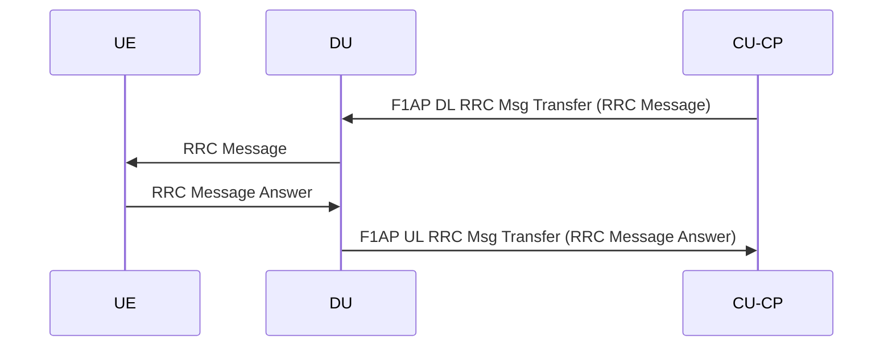
```mermaid
sequenceDiagram
  participant ue as UE
  participant du as DU
  participant cucp as CU-CP
  cucp->>du: F1AP DL RRC Msg Transfer (RRC Message)
  du->>ue: RRC Message
  ue->>du: RRC Message Answer
  du->>cucp: F1AP UL RRC Msg Transfer (RRC Message Answer)
```

To better utilize horizontal space, these exchanges have been collapsed as
follows, but should be read as the above exchange:

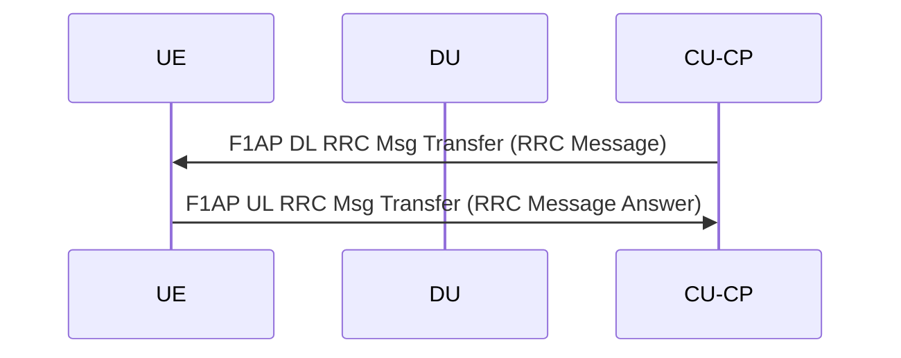
```mermaid
sequenceDiagram
  participant ue as UE
  participant du as DU
  participant cucp as CU-CP
  cucp->>ue: F1AP DL RRC Msg Transfer (RRC Message)
  ue->>cucp: F1AP UL RRC Msg Transfer (RRC Message Answer)
```

### Initial connection setup/Registration

This sequence diagram shows the principal steps for an initial UE connection.
This can either happen through a _Registration Request_ (e.g., UE connects
"from flight mode"), or a _Service Request_ (i.e., UE connects after leaving
coverage). Both requests are handled similarly by the gNB, and basically
distinguish themselves, from the point of view of the gNB, by having PDU
sessions in the NGAP Initial Context Setup Request present (Service Request) or
not (Registration Request, with following PDU Session Resource Setup Request
procedure).

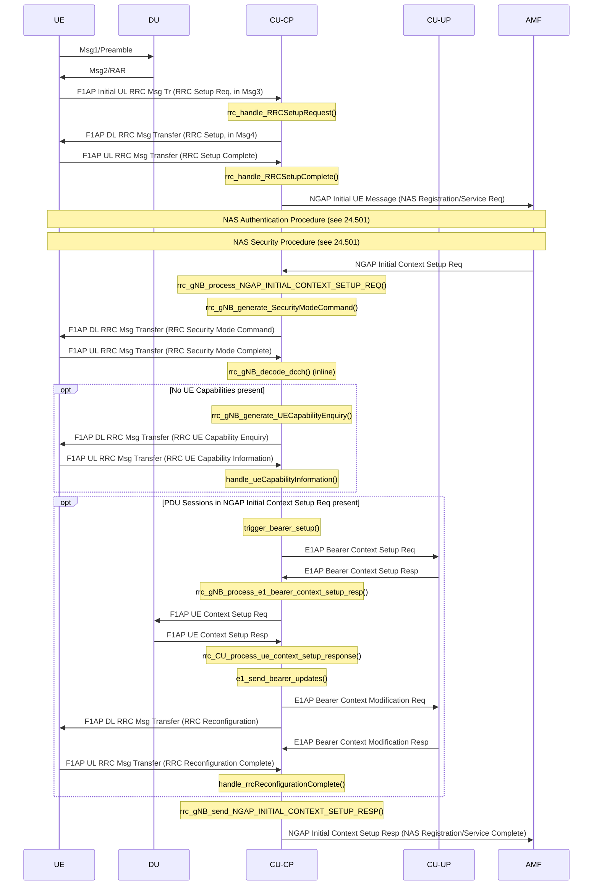
```mermaid
sequenceDiagram
  participant ue as UE
  participant du as DU
  participant cucp as CU-CP
  participant cuup as CU-UP
  participant amf as AMF

  ue->>du: Msg1/Preamble
  du->>ue: Msg2/RAR
  ue->>cucp: F1AP Initial UL RRC Msg Tr (RRC Setup Req, in Msg3)
  Note over cucp: rrc_handle_RRCSetupRequest()
  cucp->>ue: F1AP DL RRC Msg Transfer (RRC Setup, in Msg4)
  ue->>cucp: F1AP UL RRC Msg Transfer (RRC Setup Complete)
  Note over cucp: rrc_handle_RRCSetupComplete()
%% TODO: when is RRC connected?
  cucp->>amf: NGAP Initial UE Message (NAS Registration/Service Req)
  Note over amf,ue: NAS Authentication Procedure (see 24.501)
  Note over amf,ue: NAS Security Procedure (see 24.501)
  amf->>cucp: NGAP Initial Context Setup Req
  Note over cucp: rrc_gNB_process_NGAP_INITIAL_CONTEXT_SETUP_REQ()
  Note over cucp: rrc_gNB_generate_SecurityModeCommand()
  cucp->>ue: F1AP DL RRC Msg Transfer (RRC Security Mode Command)
  ue->>cucp: F1AP UL RRC Msg Transfer (RRC Security Mode Complete)
  Note over cucp: rrc_gNB_decode_dcch() (inline)
  opt No UE Capabilities present
    Note over cucp: rrc_gNB_generate_UECapabilityEnquiry()
    cucp->>ue: F1AP DL RRC Msg Transfer (RRC UE Capability Enquiry)
    ue->>cucp: F1AP UL RRC Msg Transfer (RRC UE Capability Information)
    Note over cucp: handle_ueCapabilityInformation()
  end
  opt PDU Sessions in NGAP Initial Context Setup Req present
    Note over cucp: trigger_bearer_setup()
    cucp->>cuup: E1AP Bearer Context Setup Req
    cuup->>cucp: E1AP Bearer Context Setup Resp
    Note over cucp: rrc_gNB_process_e1_bearer_context_setup_resp()
    cucp->>du: F1AP UE Context Setup Req
    du->>cucp: F1AP UE Context Setup Resp
    Note over cucp: rrc_CU_process_ue_context_setup_response()
    Note over cucp: e1_send_bearer_updates()
    cucp->>cuup: E1AP Bearer Context Modification Req
    cucp->>ue: F1AP DL RRC Msg Transfer (RRC Reconfiguration)
    cuup->>cucp: E1AP Bearer Context Modification Resp
    ue->>cucp: F1AP UL RRC Msg Transfer (RRC Reconfiguration Complete)
    Note over cucp: handle_rrcReconfigurationComplete()
  end
  Note over cucp: rrc_gNB_send_NGAP_INITIAL_CONTEXT_SETUP_RESP()
  cucp->>amf: NGAP Initial Context Setup Resp (NAS Registration/Service Complete)
```

Note that if no PDU session is present in the NGAP Initial UE Context Setup
Req, no F1AP UE Context Setup will be observed during this initial phase.

If there is no PDU session set up during NGAP Initial Context Setup Req, the UE
typically requests a PDU session(s) through a NAS procedure, which is basically
the same code paths as the above optional PDU Session setup during an NGAP
Initial Context Setup procedure:

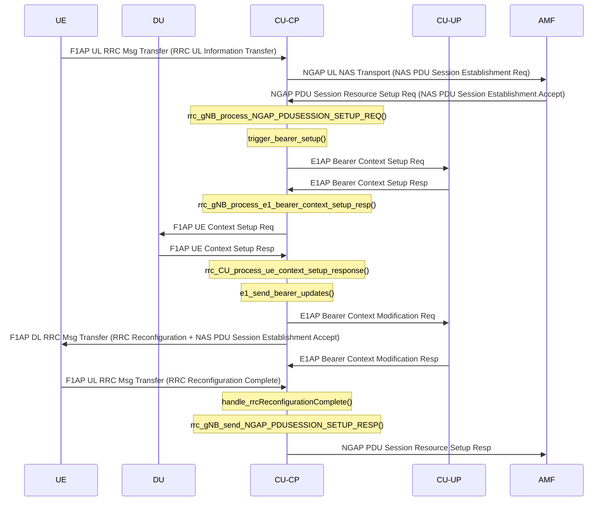
```mermaid
sequenceDiagram
  participant ue as UE
  participant du as DU
  participant cucp as CU-CP
  participant cuup as CU-UP
  participant amf as AMF

  ue->>cucp: F1AP UL RRC Msg Transfer (RRC UL Information Transfer)
  cucp->>amf: NGAP UL NAS Transport (NAS PDU Session Establishment Req)
  amf->>cucp: NGAP PDU Session Resource Setup Req (NAS PDU Session Establishment Accept)
  Note over cucp: rrc_gNB_process_NGAP_PDUSESSION_SETUP_REQ()
    Note over cucp: trigger_bearer_setup()
    cucp->>cuup: E1AP Bearer Context Setup Req
    cuup->>cucp: E1AP Bearer Context Setup Resp
  Note over cucp: rrc_gNB_process_e1_bearer_context_setup_resp()
  cucp->>du: F1AP UE Context Setup Req
  du->>cucp: F1AP UE Context Setup Resp
  Note over cucp: rrc_CU_process_ue_context_setup_response()
    Note over cucp: e1_send_bearer_updates()
    cucp->>cuup: E1AP Bearer Context Modification Req
  cucp->>ue: F1AP DL RRC Msg Transfer (RRC Reconfiguration + NAS PDU Session Establishment Accept)
    cuup->>cucp: E1AP Bearer Context Modification Resp
  ue->>cucp: F1AP UL RRC Msg Transfer (RRC Reconfiguration Complete)
  Note over cucp: handle_rrcReconfigurationComplete()
  Note over cucp: rrc_gNB_send_NGAP_PDUSESSION_SETUP_RESP()
  cucp->>amf: NGAP PDU Session Resource Setup Resp
```

### Reestablishment

The following sequence diagram shows the principal steps during a
reestablishment request. When handling the RRC Reestablishment Request at the
CU-CP, it notably checks if this UE is already known, if the UE is still at the
same DU as it used to be previously (might change because of, or despite
handover), and other validation checks. If all checks pass, the CU-CP continues
with the reestablishment procedure; if any check fails, the CU-CP tries to
release the old UE at the AMF, and continues with the "normal" connection setup
(registration/service request) described above.

The re-establishment flow implements transparent forwarding of CellGroupConfig
per TS 38.473: the CU requests CellGroupConfig from the DU via UE Context
Modification Request with `gNB_DU_Configuration_Query=true`, and the DU responds
with an encoded CellGroupConfig that the CU forwards to the UE without
decode/re-encode cycles.

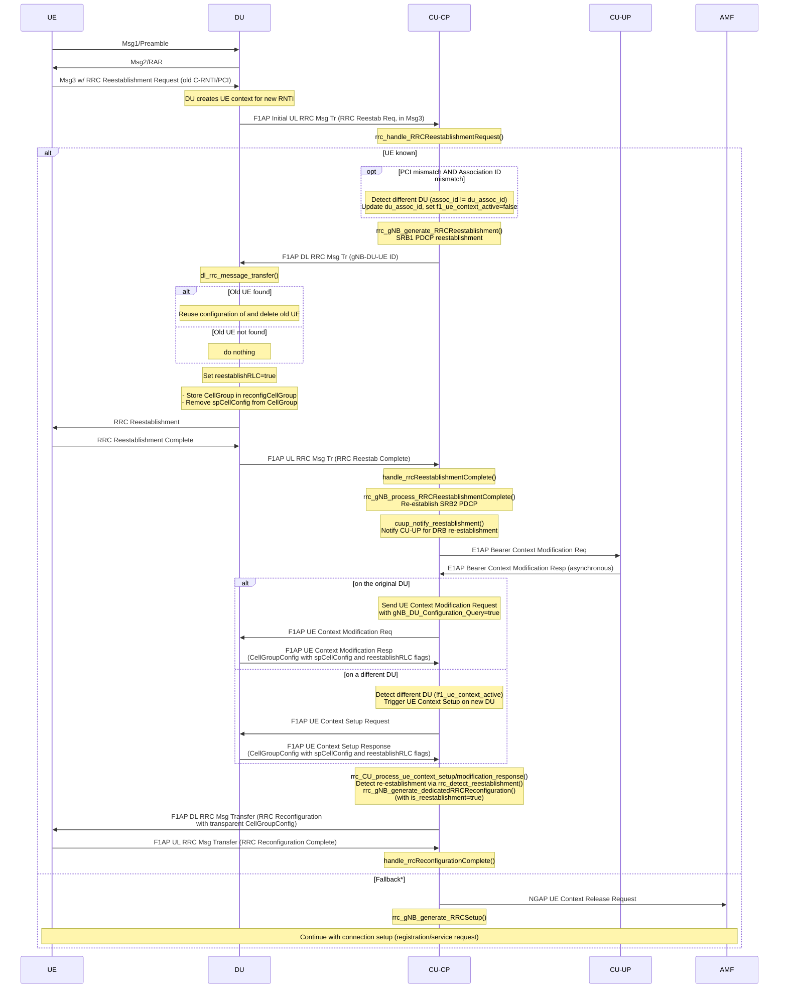
```mermaid
sequenceDiagram
  participant ue as UE
  participant du as DU
  participant cucp as CU-CP
  participant cuup as CU-UP
  participant amf as AMF

  ue->>du: Msg1/Preamble
  du->>ue: Msg2/RAR
  ue->>du: Msg3 w/ RRC Reestablishment Request (old C-RNTI/PCI)
  Note over du: DU creates UE context for new RNTI
  du->>cucp: F1AP Initial UL RRC Msg Tr (RRC Reestab Req, in Msg3)
  Note over cucp: rrc_handle_RRCReestablishmentRequest()
  alt UE known
      opt PCI mismatch AND Association ID mismatch
        Note over cucp: Detect different DU (assoc_id != du_assoc_id)<br/>Update du_assoc_id, set f1_ue_context_active=false
      end
      Note over cucp: rrc_gNB_generate_RRCReestablishment()<br/>SRB1 PDCP reestablishment
      cucp->>du: F1AP DL RRC Msg Tr (gNB-DU-UE ID)
      Note over du: dl_rrc_message_transfer()
        alt Old UE found
          Note over du: Reuse configuration of and delete old UE
        else Old UE not found
          Note over du: do nothing
        end
      Note over du: Set reestablishRLC=true
      Note over du: - Store CellGroup in reconfigCellGroup<br/>- Remove spCellConfig from CellGroup
      du->>ue: RRC Reestablishment
      ue->>du: RRC Reestablishment Complete
      du->>cucp: F1AP UL RRC Msg Tr (RRC Reestab Complete)
      Note over cucp: handle_rrcReestablishmentComplete()
      Note over cucp: rrc_gNB_process_RRCReestablishmentComplete()<br/>Re-establish SRB2 PDCP
      Note over cucp: cuup_notify_reestablishment()<br/>Notify CU-UP for DRB re-establishment
      cucp->>cuup: E1AP Bearer Context Modification Req
      cuup->>cucp: E1AP Bearer Context Modification Resp (asynchronous)
      alt on the original DU
          Note over cucp: Send UE Context Modification Request<br/>with gNB_DU_Configuration_Query=true
          cucp->>du: F1AP UE Context Modification Req
          du->>cucp: F1AP UE Context Modification Resp<br/>(CellGroupConfig with spCellConfig and reestablishRLC flags)
      else on a different DU
          Note over cucp: Detect different DU (!f1_ue_context_active)<br/>Trigger UE Context Setup on new DU
          cucp->>du: F1AP UE Context Setup Request<br/>
          du->>cucp: F1AP UE Context Setup Response<br/>(CellGroupConfig with spCellConfig and reestablishRLC flags)
      end
      Note over cucp: rrc_CU_process_ue_context_setup/modification_response()<br/>Detect re-establishment via rrc_detect_reestablishment()<br/>rrc_gNB_generate_dedicatedRRCReconfiguration()<br/>(with is_reestablishment=true)
      cucp->>ue: F1AP DL RRC Msg Transfer (RRC Reconfiguration<br/>with transparent CellGroupConfig)
      ue->>cucp: F1AP UL RRC Msg Transfer (RRC Reconfiguration Complete)
      Note over cucp: handle_rrcReconfigurationComplete()
  else Fallback*
      cucp->>amf: NGAP UE Context Release Request
      Note over cucp: rrc_gNB_generate_RRCSetup()
      Note over ue,amf: Continue with connection setup (registration/service request)
  end
```

Note on re-establishment on different DU: The "UE known and on a different DU"
case is shown in the sequence diagram above. When a UE re-establishes on a
different DU than the original one (detected by comparing `du_assoc_id` at
RRCReestablishmentRequest), the CU updates `du_assoc_id` and sets
`f1_ue_context_active=false`. At RRCReestablishmentComplete, if
`f1_ue_context_active` is false, the CU triggers UE Context Setup on the new
DU per TS 38.401 §8.7.

### PDU Session Management

#### PDU Session Modification

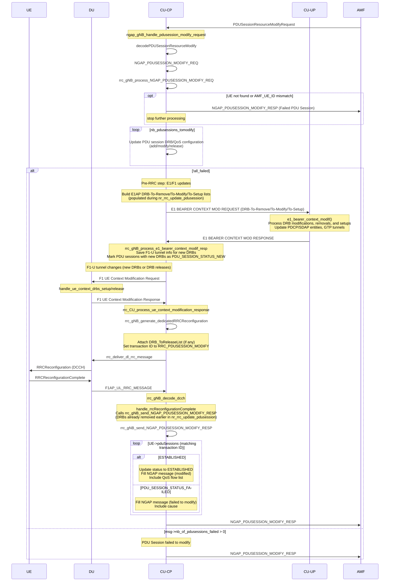
```mermaid
sequenceDiagram
    participant UE
    participant DU
    participant CUCP as CU-CP
    participant CUUP as CU-UP
    participant AMF

    AMF->>CUCP: PDUSessionResourceModifyRequest
    Note over CUCP: ngap_gNB_handle_pdusession_modify_request
    CUCP->>CUCP: decodePDUSessionResourceModify
    CUCP->>CUCP: NGAP_PDUSESSION_MODIFY_REQ
    CUCP->>CUCP: rrc_gNB_process_NGAP_PDUSESSION_MODIFY_REQ
    opt UE not found or AMF_UE_ID mismatch
        CUCP->>AMF: NGAP_PDUSESSION_MODIFY_RESP (Failed PDU Session)
        Note over CUCP: stop further processing
    end

    loop nb_pdusessions_tomodify
        CUCP->>CUCP: Update PDU session DRB/QoS configuration<br/>(add/modify/release)
    end

    alt !all_failed
        Note over CUCP: Pre-RRC step: E1/F1 updates
        Note over CUCP: Build E1AP DRB-To-Remove/To-Modify/To-Setup lists<br/>(populated during nr_rrc_update_pdusession)
        CUCP->>CUUP: E1 BEARER CONTEXT MOD REQUEST (DRB-To-Remove/To-Modify/To-Setup)
        Note over CUUP: e1_bearer_context_modif()<br/>Process DRB modifications, removals, and setups<br/>Update PDCP/SDAP entities, GTP tunnels
        CUUP->>CUCP: E1 BEARER CONTEXT MOD RESPONSE
        Note over CUCP: rrc_gNB_process_e1_bearer_context_modif_resp<br/>Save F1-U tunnel info for new DRBs<br/>Mark PDU sessions with new DRBs as PDU_SESSION_STATUS_NEW
        Note over CUCP, DU: F1-U tunnel changes (new DRBs or DRB releases)
        CUCP->>DU: F1 UE Context Modification Request
        Note over DU: handle_ue_context_drbs_setup/release
        DU->>CUCP: F1 UE Context Modification Response
        Note over CUCP: rrc_CU_process_ue_context_modification_response
        CUCP->>CUCP: rrc_gNB_generate_dedicatedRRCReconfiguration

        Note over CUCP: <br/>Attach DRB_ToReleaseList (if any)<br/>Set transaction ID to RRC_PDUSESSION_MODIFY
        CUCP->>DU: rrc_deliver_dl_rrc_message
        DU->>UE: RRCReconfiguration (DCCH)
        UE->>DU: RRCReconfigurationComplete
        DU->>CUCP: F1AP_UL_RRC_MESSAGE
        Note over CUCP: rrc_gNB_decode_dcch
        Note over CUCP: handle_rrcReconfigurationComplete<br/>Calls rrc_gNB_send_NGAP_PDUSESSION_MODIFY_RESP<br/>(DRBs already removed earlier in nr_rrc_update_pdusession)

        CUCP->>CUCP: rrc_gNB_send_NGAP_PDUSESSION_MODIFY_RESP
        loop UE->pduSessions (matching transaction ID)
            alt ESTABLISHED
                Note over CUCP: Update status to ESTABLISHED<br/>Fill NGAP message (modified)<br/>Include QoS flow list
            else PDU_SESSION_STATUS_FAILED
                Note over CUCP: Fill NGAP message (failed to modify)<br/>Include cause
            end
        end
        CUCP->>AMF: NGAP_PDUSESSION_MODIFY_RESP
    else msg->nb_of_pdusessions_failed > 0
        Note over CUCP: PDU Session failed to modify
        CUCP->>AMF: NGAP_PDUSESSION_MODIFY_RESP
end
```

#### PDU Session Release

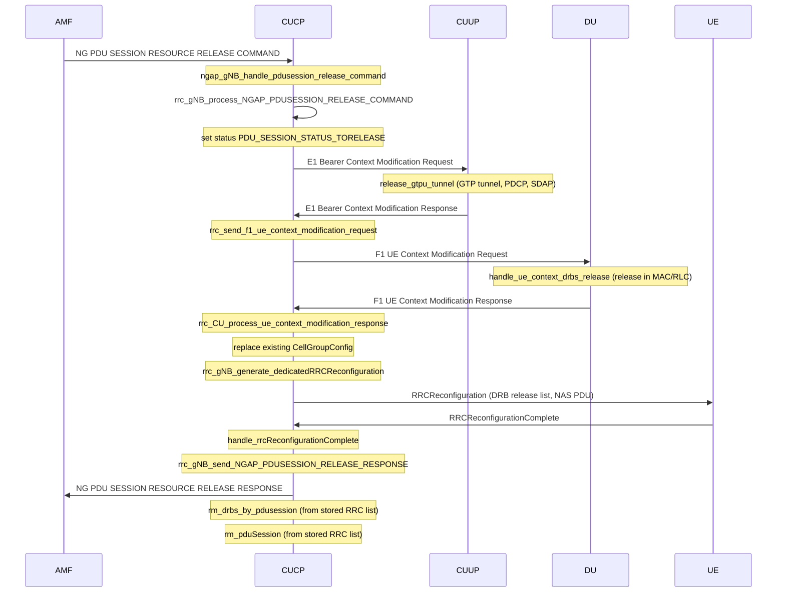
```mermaid
sequenceDiagram
    participant AMF
    participant CUCP
    participant CUUP
    participant DU
    participant UE
    AMF->>CUCP: NG PDU SESSION RESOURCE RELEASE COMMAND
    Note over CUCP: ngap_gNB_handle_pdusession_release_command
    CUCP->>CUCP: rrc_gNB_process_NGAP_PDUSESSION_RELEASE_COMMAND
    Note over CUCP: set status PDU_SESSION_STATUS_TORELEASE
    CUCP->>CUUP: E1 Bearer Context Modification Request
    Note over CUUP: release_gtpu_tunnel (GTP tunnel, PDCP, SDAP)
    CUUP->>CUCP: E1 Bearer Context Modification Response
    Note over CUCP: rrc_send_f1_ue_context_modification_request
    CUCP->>DU: F1 UE Context Modification Request
    Note over DU: handle_ue_context_drbs_release (release in MAC/RLC)
    DU->>CUCP: F1 UE Context Modification Response
    Note over CUCP: rrc_CU_process_ue_context_modification_response
    Note over CUCP: replace existing CellGroupConfig
    Note over CUCP: rrc_gNB_generate_dedicatedRRCReconfiguration
    CUCP->>UE: RRCReconfiguration (DRB release list, NAS PDU)
    UE->>CUCP: RRCReconfigurationComplete
    Note over CUCP: handle_rrcReconfigurationComplete
    Note over CUCP: rrc_gNB_send_NGAP_PDUSESSION_RELEASE_RESPONSE
    CUCP->>AMF: NG PDU SESSION RESOURCE RELEASE RESPONSE
    Note over CUCP: rm_drbs_by_pdusession (from stored RRC list)
    Note over CUCP: rm_pduSession (from stored RRC list)
```

### QoS Flows Handling

This section describes the end-to-end handling of QoS flows in the OAI 5G SA implementation. QoS flows are
the finest granularity of QoS differentiation in 5G systems. According to 3GPP specs, each PDU session can
contain multiple QoS flows (maximum 64). Each QoS flow is mapped to exactly one Data Radio Bearer (DRB)
within the gNB, but multiple QoS flows can be mapped to the same DRB. The mapping is determined by the
CU-CP and configured in the CU-UP via E1AP, and in the UE via RRC signaling. Each PDU session is mapped
to a SDAP entity and can contain multiple DRBs, each of which may carry multiple QoS flows.

Key Standards:
- 3GPP TS 23.501: 5G System Architecture (6.2.5, Quality of service)
- 3GPP TS 37.324: SDAP Protocol (QoS flow to DRB mapping, 5.3)
- 3GPP TS 38.463: E1AP (Bearer Context Management with QoS flows)
- 3GPP TS 29.281: GTP-U (QFI marking)
- 3GPP TS 38.331: RRC (Radio Bearer Configuration)

Trigger: PDU Session Establishment or Modification from 5G Core (AMF/SMF)

The PDU session setup flow in OAI begins when the gNB receives an NGAP PDU Session Resource Setup Request
from the AMF, containing session parameters and QoS flow information. These flows are stored in the UE
context and passed to the RRC layer, which maps each QoS flow to a DRB and prepares the E1AP Bearer
Context Setup Request for the CU-UP. The CU-UP then creates the corresponding PDCP and SDAP bearers,
establishes F1-U and N3 GTP-U tunnels, and returns a Bearer Context Setup Response. The GTP-U layer stores
QFI-to-DRB mappings for tunnel management, while the SDAP layer maintains QFI-to-DRB tables for both
uplink and downlink packet routing.

During data transfer, uplink packets are demultiplexed using the QFI from the GTP-U header, and downlink
packets are marked with their QFI before being sent to the UPF, ensuring consistent QoS-based traffic
handling end-to-end.

#### CU-CP QoS-flow to DRB mapping

The QoS-flow-to-DRB algorithm runs in the CU-CP (RRC) when flows are added or updated (for example
`nr_rrc_add_bearers`, `nr_rrc_assign_drb_to_qos_flow`, and `nr_rrc_find_suitable_drb_for_qos` in
`openair2/RRC/NR/rrc_gNB_radio_bearers.c`). E1AP does not implement this policy: Bearer Context
Setup/Modification simply carries the resulting PDU sessions, DRB lists, and QoS flows per DRB that RRC
already chose.

The mapping is OAI-specific (3GPP defines that the gNB may map multiple QoS flows to one DRB but does
not mandate these numeric caps).

DRB assignment uses a QoS-aware multiplexing strategy from standardized 5QI where available:

- Dedicated DRBs (one QoS flow per DRB in practice for these classes):
  - Delay-critical GBR (5QI 82–90): each such flow triggers a new DRB, existing DRBs that already carry
    DC-GBR are not reused for other flows.
  - Other flows treated as isolated: 5QI 4, 6, 7, 8, 9, 10, 70, 80, and 71-73.

- Multiplexed DRBs (when the new flow is not in the dedicated set, and reuse is allowed on a PDU session):
  - Non-delay-critical GBR flows: up to 2 QoS flows per DRB.
  - Non-GBR flows: up to 5 QoS flows per DRB.
  - Aggregate cap: at most 5 QoS flows per DRB in total (mixed GBR/non-GBR counts).

Per-DRB counting uses resource-type buckets (DC-GBR, GBR, non-GBR) derived from 3GPP TS 23.501
table 5.7.4-1 (standardized 5QI).

Dynamic 5QI without a numeric 5QI: OAI uses a conservative heuristic (packet delay budget, packet
error rate, and QoS priority thresholds) to decide whether the flow must use a new dedicated DRB or
may share an existing DRB. That path is independent of the static 5QI lists above.

#### Sequence Diagram

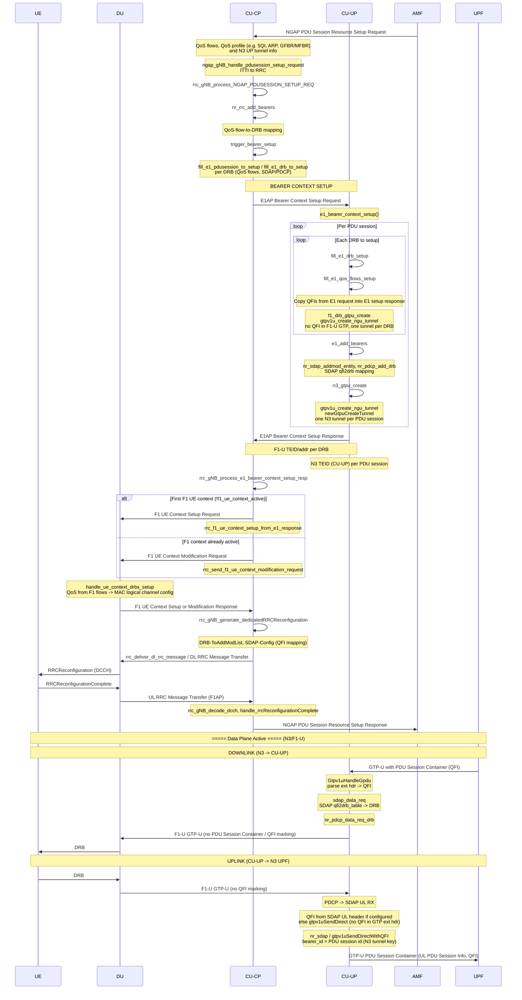
```mermaid
sequenceDiagram
    participant UE
    participant DU
    participant CUCP as CU-CP
    participant CUUP as CU-UP
    participant AMF
    participant UPF

    AMF->>CUCP: NGAP PDU Session Resource Setup Request
    Note over CUCP: QoS flows, QoS profile (e.g. 5QI, ARP, GFBR/MFBR)<br/>and N3 UP tunnel info
    Note over CUCP: ngap_gNB_handle_pdusession_setup_request<br/>ITTI to RRC
    CUCP->>CUCP: rrc_gNB_process_NGAP_PDUSESSION_SETUP_REQ
    CUCP->>CUCP: nr_rrc_add_bearers
    Note over CUCP: QoS-flow-to-DRB mapping
    CUCP->>CUCP: trigger_bearer_setup
    Note over CUCP: fill_e1_pdusession_to_setup / fill_e1_drb_to_setup<br/>per DRB (QoS flows, SDAP/PDCP)

    Note over CUCP,CUUP: BEARER CONTEXT SETUP
    CUCP->>CUUP: E1AP Bearer Context Setup Request

      Note over CUUP: e1_bearer_context_setup()
      loop Per PDU session
          loop Each DRB to setup
              CUUP->>CUUP: fill_e1_drb_setup
              CUUP->>CUUP: fill_e1_qos_flows_setup
              Note over CUUP: Copy QFIs from E1 request into E1 setup response
              Note over CUUP: f1_drb_gtpu_create<br/>gtpv1u_create_ngu_tunnel<br/>no QFI in F1-U GTP, one tunnel per DRB
          end
          CUUP->>CUUP: e1_add_bearers
          Note over CUUP: nr_sdap_addmod_entity, nr_pdcp_add_drb<br/>SDAP qfi2drb mapping
          CUUP->>CUUP: n3_gtpu_create
          Note over CUUP: gtpv1u_create_ngu_tunnel<br/>newGtpuCreateTunnel<br/>one N3 tunnel per PDU session
      end
    CUUP->>CUCP: E1AP Bearer Context Setup Response
    Note over CUCP,CUUP: F1-U TEID/addr per DRB
    Note over CUUP: N3 TEID (CU-UP) per PDU session

    CUCP->>CUCP: rrc_gNB_process_e1_bearer_context_setup_resp
    alt First F1 UE context (!f1_ue_context_active)
        CUCP->>DU: F1 UE Context Setup Request
        Note over CUCP: rrc_f1_ue_context_setup_from_e1_response
    else F1 context already active
        CUCP->>DU: F1 UE Context Modification Request
        Note over CUCP: rrc_send_f1_ue_context_modification_request
    end
    Note over DU: handle_ue_context_drbs_setup<br/>QoS from F1 flows -> MAC logical channel config
    DU->>CUCP: F1 UE Context Setup or Modification Response

    CUCP->>CUCP: rrc_gNB_generate_dedicatedRRCReconfiguration
    Note over CUCP: DRB-ToAddModList, SDAP-Config (QFI mapping)
    CUCP->>DU: rrc_deliver_dl_rrc_message / DL RRC Message Transfer
    DU->>UE: RRCReconfiguration (DCCH)

    UE->>DU: RRCReconfigurationComplete
    DU->>CUCP: UL RRC Message Transfer (F1AP)
    Note over CUCP: rrc_gNB_decode_dcch, handle_rrcReconfigurationComplete

    CUCP->>AMF: NGAP PDU Session Resource Setup Response

    Note over UPF,UE: ===== Data Plane Active ===== (N3/F1-U)

    Note over UPF,UE: DOWNLINK (N3 -> CU-UP)
    UPF->>CUUP: GTP-U with PDU Session Container (QFI)
    Note over CUUP: Gtpv1uHandleGpdu<br/>parse ext hdr -> QFI
    Note over CUUP: sdap_data_req<br/>SDAP qfi2drb_table -> DRB
    Note over CUUP: nr_pdcp_data_req_drb
    CUUP->>DU: F1-U GTP-U (no PDU Session Container / QFI marking)
    DU->>UE: DRB

    Note over UE,UPF: UPLINK (CU-UP -> N3 UPF)
    UE->>DU: DRB
    DU->>CUUP: F1-U GTP-U (no QFI marking)
    Note over CUUP: PDCP -> SDAP UL RX
    Note over CUUP: QFI from SDAP UL header if configured<br/>else gtpv1uSendDirect (no QFI in GTP ext hdr)
    Note over CUUP: nr_sdap / gtpv1uSendDirectWithQFI<br/>bearer_id = PDU session id (N3 tunnel key)
    CUUP->>UPF: GTP-U PDU Session Container (UL PDU Session Info, QFI)
```

### Inter-DU Handover (F1)

The basic handover (HO) structure is as follows. In order to support various
handover "message passing implementation" (F1AP, NGAP, XnAP), RRC employs
callbacks to signal HO Accept (`ho_req_ack()`), HO Success (`ho_success()`),
and HO Cancel (`ho_cancel()`). These can be used to trigger the corresponding
functionality based on mentioned "message passing implementation".

The following sequence diagram shows the basic functional execution of a
successful handover in the case of an F1 handover. Note the callbacks as
mentioned above:

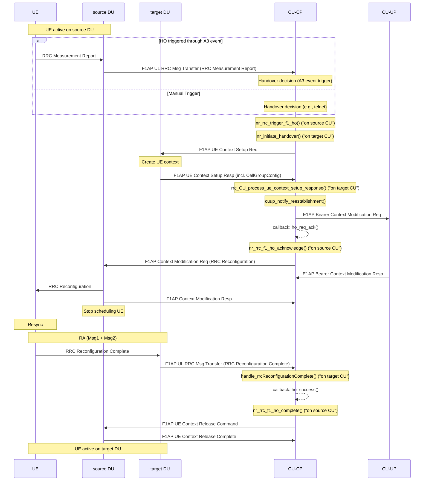
```mermaid
sequenceDiagram
  participant ue as UE
  participant sdu as source DU
  participant tdu as target DU
  participant cucp as CU-CP
  participant cuup as CU-UP

  Note over ue,sdu: UE active on source DU
  alt HO triggered through A3 event
    ue->>sdu: RRC Measurement Report
    sdu->>cucp: F1AP UL RRC Msg Transfer (RRC Measurement Report)
    Note over cucp: Handover decision (A3 event trigger)
  else Manual Trigger
    Note over cucp: Handover decision (e.g., telnet)
  end
  Note over cucp: nr_rrc_trigger_f1_ho() ("on source CU")
  Note over cucp: nr_initiate_handover() ("on target CU")
  cucp->>tdu: F1AP UE Context Setup Req
  Note over tdu: Create UE context
  tdu->>cucp: F1AP UE Context Setup Resp (incl. CellGroupConfig)
  Note over cucp: rrc_CU_process_ue_context_setup_response() ("on target CU")
    Note over cucp: cuup_notify_reestablishment()
    cucp->>cuup: E1AP Bearer Context Modification Req
  cucp-->>cucp: callback: ho_req_ack()
  Note over cucp: nr_rrc_f1_ho_acknowledge() ("on source CU")
  cucp->>sdu: F1AP Context Modification Req (RRC Reconfiguration)
    cuup->>cucp: E1AP Bearer Context Modification Resp
  sdu->>ue: RRC Reconfiguration
  sdu->>cucp: F1AP Context Modification Resp
  Note over sdu: Stop scheduling UE
  Note over ue: Resync
  Note over ue,tdu: RA (Msg1 + Msg2)
  ue->>tdu: RRC Reconfiguration Complete
  tdu->>cucp: F1AP UL RRC Msg Transfer (RRC Reconfiguration Complete)
  Note over cucp: handle_rrcReconfigurationComplete() ("on target CU")
  cucp-->>cucp: callback: ho_success()
  Note over cucp: nr_rrc_f1_ho_complete() ("on source CU")
  cucp->>sdu: F1AP UE Context Release Command
  sdu->>cucp: F1AP UE Context Release Complete
  Note over ue,tdu: UE active on target DU
```
### Inter-gNB Handover (N2)

This is an inter-NG-RAN procedure. The N2 handover specification is defined in the following documents:

* 3GPP TS 23.502, 4.9.1.3 Inter NG-RAN node N2 based handover:
  - Outlines detailed handover signaling flows for N2-based handovers.
  - Covers both intra-system (between 5G gNBs) and inter-system (between 5G and LTE eNBs) handovers.
* 3GPP TS 38.300, section 9 Mobility and State Transitions:
  - describes mobility procedures at the NG-RAN level, depending on the RRC state.
* 3GPP TS 38.413 (NGAP), section 8.4 UE Mobility Management Procedures:
  - Specifies the signaling procedures over the N2 interface.
  - Includes messages like Handover Request, Handover Command, and Handover Preparation.
* 3GPP TS 38.331 (RRC): details the UE-level RRC procedures involved during handovers

#### End-to-end flow

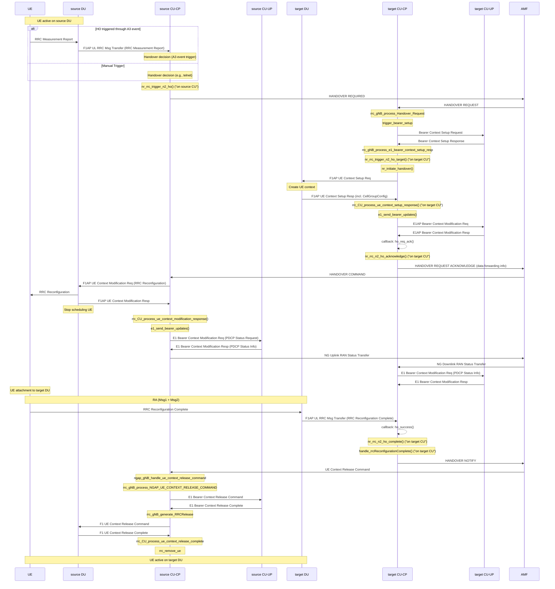
```mermaid
sequenceDiagram
  participant ue as UE
  participant sdu as source DU
  participant scucp as source CU-CP
  participant scuup as source CU-UP
  participant tdu as target DU
  participant tcucp as target CU-CP
  participant tcuup as target CU-UP
  participant amf as AMF

  Note over ue,sdu: UE active on source DU
  alt HO triggered through A3 event
    ue->>sdu: RRC Measurement Report
    sdu->>scucp: F1AP UL RRC Msg Transfer (RRC Measurement Report)
    Note over scucp: Handover decision (A3 event trigger)
  else Manual Trigger
    Note over scucp: Handover decision (e.g., telnet)
  end
  Note over scucp: nr_rrc_trigger_n2_ho() ("on source CU")
  scucp->>amf: HANDOVER REQUIRED
  amf->>tcucp: HANDOVER REQUEST
  Note over tcucp: rrc_gNB_process_Handover_Request
  Note over tcucp: trigger_bearer_setup
  tcucp->>tcuup: Bearer Context Setup Request
  tcuup->>tcucp: Bearer Context Setup Response
  Note over tcucp: rrc_gNB_process_e1_bearer_context_setup_resp
  Note over tcucp: nr_rrc_trigger_n2_ho_target() ("on target CU")
  Note over tcucp: nr_initiate_handover()
  tcucp->>tdu: F1AP UE Context Setup Req
  Note over tdu: Create UE context
  tdu->>tcucp: F1AP UE Context Setup Resp (incl. CellGroupConfig)
  Note over tcucp: rrc_CU_process_ue_context_setup_response() ("on target CU")
  Note over tcucp: e1_send_bearer_updates()
  tcucp->>tcuup: E1AP Bearer Context Modification Req
  tcuup->>tcucp: E1AP Bearer Context Modification Resp
  tcucp-->>tcucp: callback: ho_req_ack()
  Note over tcucp: nr_rrc_n2_ho_acknowledge() ("on target CU")
  tcucp->>amf: HANDOVER REQUEST ACKNOWLEDGE (data forwarding info)
  amf->>scucp: HANDOVER COMMAND
  scucp->>sdu: F1AP UE Context Modification Req (RRC Reconfiguration)
  sdu->>ue: RRC Reconfiguration
  sdu->>scucp: F1AP UE Context Modification Resp
  Note over sdu: Stop scheduling UE
  Note over scucp: rrc_CU_process_ue_context_modification_response()
  Note over scucp: e1_send_bearer_updates()
  scucp->>scuup: E1 Bearer Context Modification Req (PDCP Status Request)
  scuup->>scucp: E1 Bearer Context Modification Resp (PDCP Status Info)
  scucp->>amf: NG Uplink RAN Status Transfer
  amf->>tcucp: NG Downlink RAN Status Transfer
  tcucp->>tcuup: E1 Bearer Context Modification Req (PDCP Status Info)
  tcuup->>tcucp: E1 Bearer Context Modification Resp
  Note over ue: UE attachment to target DU
  Note over ue,tdu: RA (Msg1 + Msg2)
  ue->>tdu: RRC Reconfiguration Complete
  tdu->>tcucp: F1AP UL RRC Msg Transfer (RRC Reconfiguration Complete)
  tcucp-->>tcucp: callback: ho_success()
  Note over tcucp: nr_rrc_n2_ho_complete() ("on target CU")
  Note over tcucp: handle_rrcReconfigurationComplete() ("on target CU")
  tcucp->>amf: HANDOVER NOTIFY
  amf->>scucp: UE Context Release Command
  note over scucp: ngap_gNB_handle_ue_context_release_command
  note over scucp: rrc_gNB_process_NGAP_UE_CONTEXT_RELEASE_COMMAND
  scucp->>scuup: E1 Bearer Context Release Command
  scuup->>scucp: E1 Bearer Context Release Complete
  Note over scucp: rrc_gNB_generate_RRCRelease
  scucp->>sdu: F1 UE Context Release Command
  sdu->>scucp: F1 UE Context Release Complete
  note over scucp: rrc_CU_process_ue_context_release_complete
  note over scucp: rrc_remove_ue
  Note over ue,tdu: UE active on target DU
```

## Structures

### DUs and Cells

OAI 5G RRC is enabling support for multiple DUs, with each DU potentially
serving multiple cells (though currently each DU is limited to one cell in practice).
The architecture separates DU management from cell management to enable future
multi-cell per DU capability.

#### DU Management

DU-related data is stored in `nr_rrc_du_container_t`, and kept in a red-black
tree indexed by the unique SCTP association ID (`assoc_id`). Each DU container stores:
- DU identity and name
- SCTP association ID for F1 interface communication
- RRC version information
- Sequential array of cell pointers (`cells`) - stores pointers to cells belonging to this DU (seq_arr_t)

Key Functions:
- `get_du_by_assoc_id()` - Lookup DU by SCTP association ID (O(log d) tree lookup)
- `get_du_for_ue()` - Get DU associated with a specific UE
- `find_target_du()` - Find a target DU for handover operations

#### Cell Management

Cell-related data is stored in `nr_rrc_cell_container_t`. Cells are stored in two data structures:

1. Global cell tree (`rrc->cells`): Red-black tree indexed by `cell_id`, containing all cells from all DUs. Used for efficient O(log N_CELL) lookups across all DUs. PCI reuse across the network is allowed and this is reflected in the tree.
2. DU cell array (`du->cells`): Sequential array (seq_arr_t) of cell pointers, storing only cells belonging to that specific DU. Used for DU-specific operations. PCI must be unique within a DU.

Each cell container stores:
- Cell identity (NR Cell ID) and PCI (Physical Cell ID)
- Link to serving DU via the unique `assoc_id`
- Cell-specific information (PLMN, TAC, frequency, mode TDD/FDD)
- MIB, SIB1, and MeasurementTimingConfiguration messages

Key Functions:
- `get_cell_by_cell_id()` - Lookup cell by NR Cell ID using global cell tree
- `rrc_get_cell_for_du()` - Lookup cell by cell_id within a specific DU's cell array
- `rrc_get_cell_by_pci_for_du()` - Lookup cell by PCI within DU's cells array
- `rrc_add_cell_to_du()` - Add cell to DU's sequential array
- `rrc_free_cell_container()` - Free cell container and associated ASN.1 structures

Architecture Notes:
- The `assoc_id` field (in cell and DUs containers) links cells to their serving DUs
- When a DU connects via F1 Setup, cells are added to both the global tree and the DU's array
- When a DU disconnects, cells are removed from both structures
- Global tree enables efficient cross-DU cell lookups (O(log N_CELL))
- DU array enables efficient per-DU cell iteration (O(k) where k=cells per DU)
- Each DU maintains a sequential array of cell pointers

##### DU and Cell Lifecycle

The following diagram shows the lifecycle of DUs and their associated cells, including the main F1AP messages and internal operations:

```mermaid
sequenceDiagram
  participant CellTree as Cell Tree
  participant DUTree as DU Tree
  participant CU as CU-CP
  participant DU as gNB-DU
  participant UE as UE

  Note over DU,CellTree: DU Connection & Cell Registration
  DU->>CU: F1AP F1 Setup Request(DU ID, Cell Info, MIB/SIB1)
  Note over CU: Validate: PLMN match with CU configuration
  alt PLMN mismatch
    CU->>DU: F1AP F1 Setup Failure (PLMN not served)
  end
  Note over CU: Validate: DU ID uniqueness (RB_FOREACH gNB_DU_id in DU tree)
  alt DU ID already exists
    CU->>DU: F1AP F1 Setup Failure (Unspecified)
  end
  Note over CU: Validate: Neighbour cell configuration (if configured)
  alt Neighbour config invalid
    CU->>DU: F1AP F1 Setup Failure (Unspecified)
  end
  Note over CU: Extract MIB/SIB1 from system info (if present)
  alt System info extraction fails
    CU->>DU: F1AP F1 Setup Failure (Semantic error)
  end
  alt All Validations Success
    CU->>CU: Create cell container (nr_rrc_cell_container_t), set assoc_id, copy cell info, set MIB/SIB1
    CU->>CellTree: rrc_add_cell(rrc, new) - RB_INSERT into global tree, increment rrc->num_cells
    alt Duplicate cell_id (collision)
      CU->>DU: F1AP F1 Setup Failure (Cell not available)
    else Cell added to tree
      CU->>CU: Create DU container (nr_rrc_du_container_t)
      CU->>CU: seq_arr_init(&du->cells) - Initialize DU's cell array
      CU->>DUTree: rrc_add_du(rrc, du) - RB_INSERT(du), increment rrc->num_dus
      CU->>CU: rrc_add_cell_to_du(&du->cells, new) - Add cell to DU's array
      Note over CU,UE: Cell available for UE association
      CU->>CU: Encode CU SIBs (if configured)
      CU->>DU: F1AP F1 Setup Response(Cells to Activate, CU SIBs)
      Note over CU,CellTree: DU and cell now active
    end
  end

  UE->>CU: RRC Setup Request
  Note over CU: rrc_handle_RRCSetupRequest()
  CU->>CU: get_cell_by_cell_id(&rrc->cells) - Use global tree
  alt Cell not found
    CU->>UE: RRC Reject
  end
  Note over CU: UE Cell Association
  CU->>CU: rrc_add_ue_serving_cell(UE, cell, RRC_PCELL_INDEX)

  Note over DU,CellTree: Optional: Cell Configuration Update
  opt DU sends configuration update
    DU->>CU: F1AP DU Configuration Update(Add/Modify/Delete cells)
    Note over CU: get_du_by_assoc_id(assoc_id)
    loop For each cell to add
      CU->>CU: get_cell_by_cell_id(&rrc->cells) - Check cell_id uniqueness globally
      alt Duplicate cell_id found
        Note over CU: Reject and return
      end
      CU->>CU: rrc_get_cell_by_pci_for_du(&du->cells) - Check PCI unique within DU
      alt Duplicate PCI in DU
        Note over CU: Reject and return
      end
    end
    loop Cell Modification
      CU->>CU: get_cell_by_cell_id(cells, old_nr_cellid) - Find cell by old cell_id
      CU->>CU: update_cell_info(rrc, old_nci, new_ci) - Update in place
      Note over CU: If cell_id changes: RB_REMOVE then re-insert after update
      Note over CU: Free old MTC if new measurement timing config provided
      Note over CU: If sys_info present: extract MIB/SIB1 and set on cell
    end
    CU->>DU: F1AP DU Configuration Update Acknowledge
  end

  Note over DU,CellTree: DU Disconnection & Cell Cleanup
  DU-->>CU: F1AP Lost Connection(SCTP connection lost)
  Note over CU: rrc_CU_process_f1_lost_connection()
  CU->>DUTree: RB_FIND(du) - Find DU by assoc_id using temporary struct
  alt DU not found
    Note over CU: Log warning and return
  end
  Note over CU: rrc_cleanup_du() then invalidate_du_connections()
  CU->>CU: Iterate cells in DU's array (last to first)
  loop For each cell in DU's array
    CU->>CU: seq_arr_erase(&du->cells, cell_ptr) - Remove from DU's array
    CU->>CellTree: rrc_rm_cell(): RB_REMOVE(cell), decrement num_cells, rrc_free_cell_container()
  end
  CU->>DUTree: rrc_rm_du(): RB_REMOVE(du) - Remove DU from tree
  CU->>CU: Decrement rrc->num_dus counter
  CU->>CU: seq_arr_free(&du->cells) - Free DU's cell array
  CU->>CU: rrc_free_du_container() - Free DU container
  Note over CU: invalidate_du_connections()
  loop For each UE:
    CU->>CU: rrc_remove_ue_scells_from_du() - Remove SCells from disconnected DU
    alt UE belongs to disconnected DU
      CU->>CU: Set du_assoc_id = 0 (mark DU offline)
      CU->>CU: Trigger NGAP UE Context Release Request
    end
  end
  Note over CU,CellTree: DU and all cells removed
```

Key Functions:
- `rrc_gNB_process_f1_setup_req()` - Handles F1 Setup Request, creates DU and cell containers.
  Validates PLMN match, DU ID uniqueness, and cell_id/PCI uniqueness before creating containers.
- `rrc_gNB_process_f1_du_configuration_update()` - Handles cell configuration updates.
  Currently supports cell modification (MIB/SIB1 updates) and validates cell additions, but cell addition
  and deletion are not yet fully implemented.
- `rrc_CU_process_f1_lost_connection()` - Handles DU disconnection. Calls `rrc_cleanup_du()` to
  remove all cells and the DU from their trees and free resources, then
  `invalidate_du_connections()` to clean up UE associations (e.g. trigger NGAP UE Context Release Request for UEs on that DU).

#### UE Cell Association Management

The RRC maintains a per-UE association with serving cells, tracking which cells
a UE is currently using. This replaces the previous single-cell assumption and
enables proper multi-cell support where each UE can have multiple serving cells
(one PCell and up to 31 SCells). The servCellIndex (TS 38.331) is tracked per-UE
in the `ue_serving_cell_t` structure in the UE context (the same cell can have
different servCellIndex values for different UEs).

Data Structures:
- `ue_serving_cell_t`: Stores serving cell information (nci, servCellIndex, assoc_id)
- `gNB_RRC_UE_t.serving_cells`: Dynamic array (seq_arr_t) of serving cell entries. PCell is always at index 0.

Key Functions:
- `rrc_add_ue_serving_cell()` - Adds a new serving cell to UE's serving_cells array.
- `rrc_get_ue_serving_cell_by_id()` - Retrieves serving cell entry by servCellIndex.
- `ue_get_pcell_entry()` - Returns the PCell serving cell entry (first element in serving_cells).
- `rrc_remove_ue_scells_from_du()` - Removes all serving cells belonging to a specific DU via assoc_id (e.g. during handover or DU disconnection).

##### Handover and Cell Association Updates

During handover, the UE's serving cell list is updated so the PCell reflects the target cell and source-DU cells are removed.

###### F1 handover (inter-DU, same CU-CP)

Cell association is updated when the **source** DU sends F1AP UE Context Modification Response (after it has sent the RRC Reconfiguration to the UE). The CU-CP is a single RRC instance; both source DU and target DU are under the same CU.

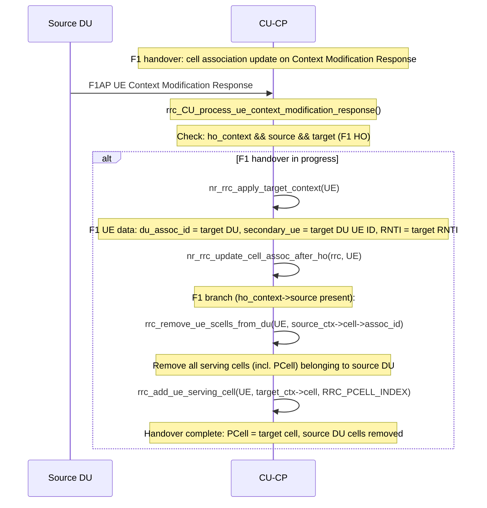
```mermaid
sequenceDiagram
  participant SourceDU as Source DU
  participant CU as CU-CP

  Note over CU,CU: F1 handover: cell association update on Context Modification Response
  SourceDU->>CU: F1AP UE Context Modification Response
  Note over CU: rrc_CU_process_ue_context_modification_response()
  Note over CU: Check: ho_context && source && target (F1 HO)

  alt F1 handover in progress
    CU->>CU: nr_rrc_apply_target_context(UE)
    Note over CU: F1 UE data: du_assoc_id = target DU, secondary_ue = target DU UE ID, RNTI = target RNTI
    CU->>CU: nr_rrc_update_cell_assoc_after_ho(rrc, UE)
    Note over CU: F1 branch (ho_context->source present):
    CU->>CU: rrc_remove_ue_scells_from_du(UE, source_ctx->cell->assoc_id)
    Note over CU: Remove all serving cells (incl. PCell) belonging to source DU
    CU->>CU: rrc_add_ue_serving_cell(UE, target_ctx->cell, RRC_PCELL_INDEX)
    Note over CU: Handover complete: PCell = target cell, source DU cells removed
  end
```

###### N2 handover (inter-gNB: source CU vs target CU)

Cell association is updated only on the target CU-CP, when the target DU sends F1AP UE Context Setup Response. The UE context was created for handover, so there is no existing serving cell to remove. The flow is triggered inside the handover request acknowledge callback.

- Target CU-CP: Receives HANDOVER REQUEST, sets up bearer and F1 UE context on target DU; when the target DU sends F1AP UE Context Setup Response, the target CU runs the cell-association update and then sends HANDOVER REQUEST ACKNOWLEDGE.

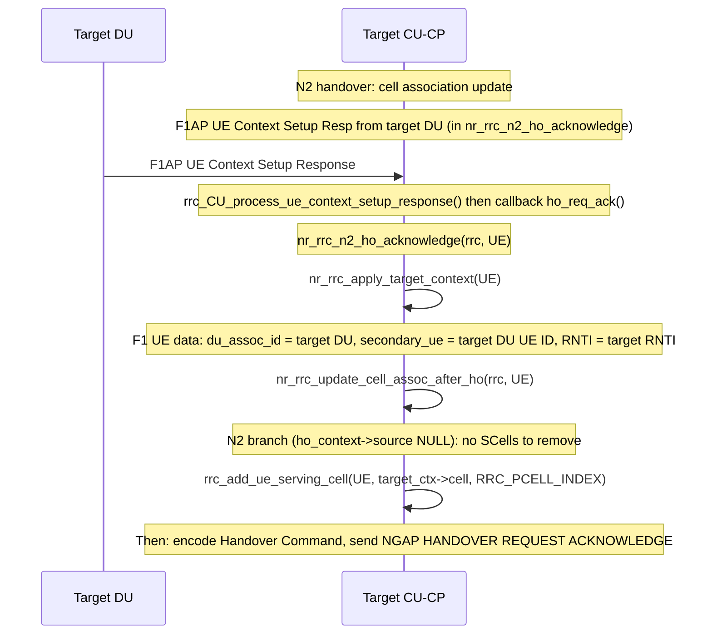
```mermaid
sequenceDiagram
  participant TargetDU as Target DU
  participant TargetCU as Target CU-CP

  Note over TargetCU: N2 handover: cell association update
  Note over TargetCU: F1AP UE Context Setup Resp from target DU (in nr_rrc_n2_ho_acknowledge)
  TargetDU->>TargetCU: F1AP UE Context Setup Response
  Note over TargetCU: rrc_CU_process_ue_context_setup_response() then callback ho_req_ack()
  Note over TargetCU: nr_rrc_n2_ho_acknowledge(rrc, UE)

  TargetCU->>TargetCU: nr_rrc_apply_target_context(UE)
  Note over TargetCU: F1 UE data: du_assoc_id = target DU, secondary_ue = target DU UE ID, RNTI = target RNTI
  TargetCU->>TargetCU: nr_rrc_update_cell_assoc_after_ho(rrc, UE)
  Note over TargetCU: N2 branch (ho_context->source NULL): no SCells to remove
  TargetCU->>TargetCU: rrc_add_ue_serving_cell(UE, target_ctx->cell, RRC_PCELL_INDEX)
  Note over TargetCU: Then: encode Handover Command, send NGAP HANDOVER REQUEST ACKNOWLEDGE
```

### Neighbour cells

#### SIB3/SIB4 and measurement-gap implementation

The following section documents the implementation-level control flow
for SIB3/SIB4 and measurement-gap handling in current OAI, using the configured
neighbor cell list as a shared input model.

Briefly, the three procedures are:
- SIB3: CU derives and provides intra-frequency neighbour SI, which DU broadcasts
  and UE uses for autonomous idle/inactive intra-frequency reselection.
- SIB4: CU derives and provides inter-frequency carrier/neighbour SI, which DU
  broadcasts and UE uses for autonomous idle/inactive inter-frequency reselection.
- MeasGap: CU/DU coordinate dedicated `MeasGapConfig` in UE `MeasConfig`, DU
  scheduler interrupts transmission (`nr_measgap_scheduling()`) for the UE to
  apply the MeasGap configuration in connected mode for gap-based measurements that
  are sent as `MeasurementReport` and processed at CU-CP (`rrc_gNB_process_MeasurementReport()`).
  Event-driven reports (for example A3) are used by CU-side mobility logic and can
  trigger handover procedures.

### MeasGap

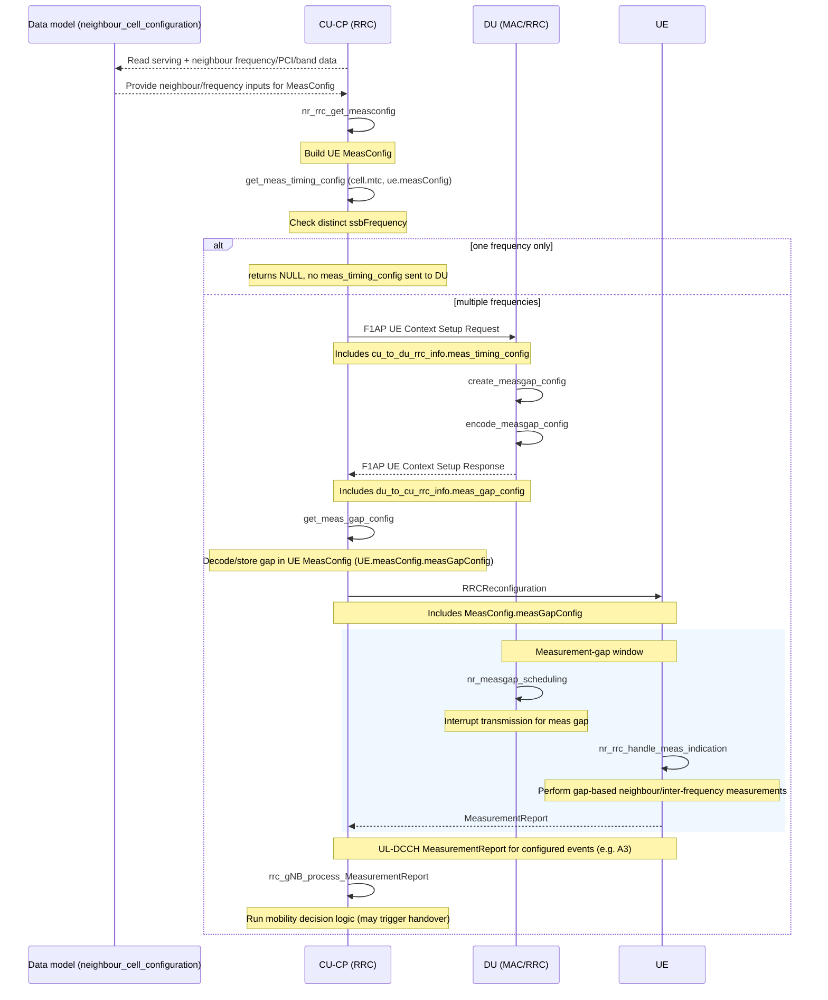
```mermaid
sequenceDiagram
  participant DM as Data model (neighbour_cell_configuration)
  participant CU as CU-CP (RRC)
  participant DU as DU (MAC/RRC)
  participant UE as UE

  CU-->>DM: Read serving + neighbour frequency/PCI/band data
  DM-->>CU: Provide neighbour/frequency inputs for MeasConfig
  CU->>CU: nr_rrc_get_measconfig
  Note over CU: Build UE MeasConfig
  CU->>CU: get_meas_timing_config (cell.mtc, ue.measConfig)
  Note over CU: Check distinct ssbFrequency
  alt one frequency only
    Note over CU: returns NULL, no meas_timing_config sent to DU
  else multiple frequencies
    CU->>DU: F1AP UE Context Setup Request
    Note over CU,DU: Includes cu_to_du_rrc_info.meas_timing_config
    DU->>DU: create_measgap_config
    DU->>DU: encode_measgap_config
    DU-->>CU: F1AP UE Context Setup Response
    Note over DU,CU: Includes du_to_cu_rrc_info.meas_gap_config
    CU->>CU: get_meas_gap_config
    Note over CU: Decode/store gap in UE MeasConfig (UE.measConfig.measGapConfig)
    CU->>UE: RRCReconfiguration
    Note over CU,UE: Includes MeasConfig.measGapConfig
    rect rgba(210, 235, 255, 0.35)
      Note over DU,UE: Measurement-gap window
      DU->>DU: nr_measgap_scheduling
      Note over DU: Interrupt transmission for meas gap
      UE->>UE: nr_rrc_handle_meas_indication
      Note over UE: Perform gap-based neighbour/inter-frequency measurements
      UE-->>CU: MeasurementReport
    end
    Note over UE,CU: UL-DCCH MeasurementReport for configured events (e.g. A3)
    CU->>CU: rrc_gNB_process_MeasurementReport
    Note over CU: Run mobility decision logic (may trigger handover)
  end
```

### SIB3/SIB4

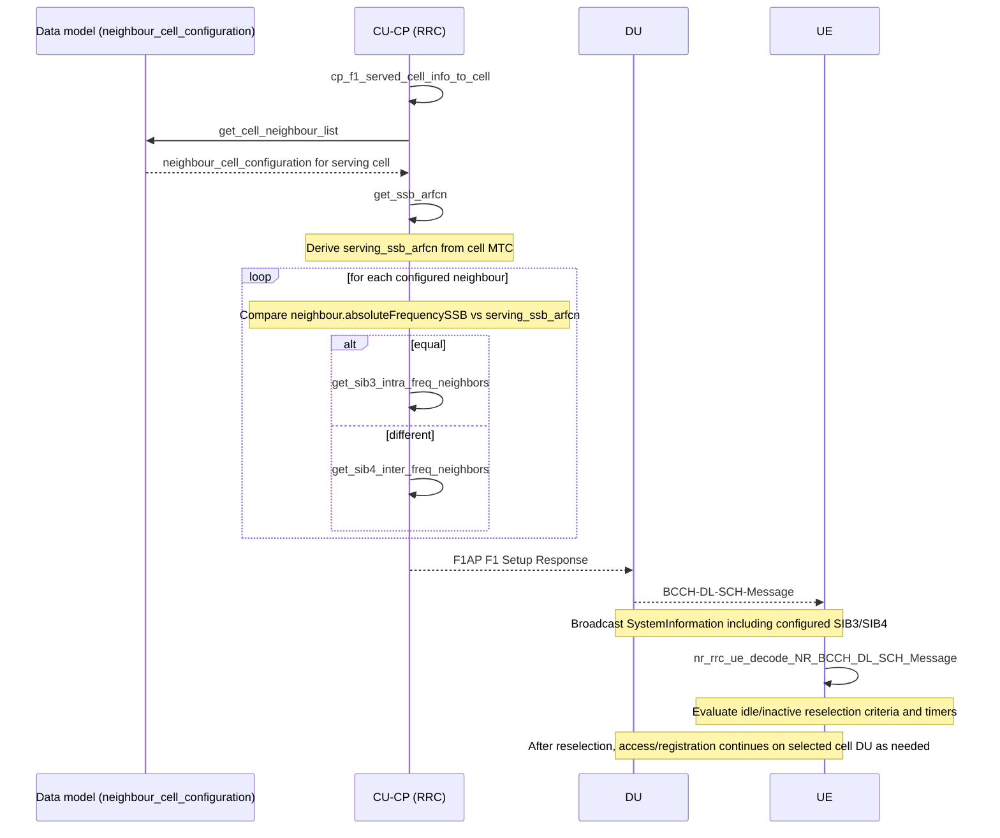
```mermaid
sequenceDiagram
  participant DM as Data model (neighbour_cell_configuration)
  participant CU as CU-CP (RRC)
  participant DU as DU
  participant UE as UE

  CU->>CU: cp_f1_served_cell_info_to_cell
  CU->>DM: get_cell_neighbour_list
  DM-->>CU: neighbour_cell_configuration for serving cell
  CU->>CU: get_ssb_arfcn
  Note over CU: Derive serving_ssb_arfcn from cell MTC
  loop for each configured neighbour
    Note over CU: Compare neighbour.absoluteFrequencySSB vs serving_ssb_arfcn
    alt equal
      CU->>CU: get_sib3_intra_freq_neighbors
    else different
      CU->>CU: get_sib4_inter_freq_neighbors
    end
  end
  CU-->>DU: F1AP F1 Setup Response
  DU-->>UE: BCCH-DL-SCH-Message
  Note over DU,UE: Broadcast SystemInformation including configured SIB3/SIB4
  UE->>UE: nr_rrc_ue_decode_NR_BCCH_DL_SCH_Message
  Note over UE: Evaluate idle/inactive reselection criteria and timers
  Note over UE,DU: After reselection, access/registration continues on selected cell DU as needed
```

## UE Context

UE context information is stored in `gNB_RRC_UE_t`, which includes:
- Serving cells tracking: Dynamic array of serving cells (PCell + SCells)
- Security context: Keys, algorithms, and security state
- Radio bearers: SRB and DRB configurations
- PDU sessions: Active PDU session information
- Handover context: Temporary data during handover procedures

### CU-UPs

CU-UP information is stored in `nr_rrc_cuup_container_t`, and kept in a tree
indexed by the SCTP association ID.

### Transactions

The RRC keeps track of ongoing transaction (RRC procedures) through a per-UE
array `xids`, which is indexed with a transaction ID `xid` in `[0,3]` to keep
track of ongoing transactions. Upon RRC Reconfiguration Complete, these IDs are
deleted.

Note that while 38.331 requires only one RRC transaction to happen at a time,
the 5G RRC does not actually ensure this; it only tries to prevent it by
chaining of transactions and some checks. For instance, the Security Mode
procedure is followed by a UE capability procedure, and some procedures are not
executed if others are ongoing (ex.: handover if there is reconfiguration).
However, it might be possible to trigger a procedure while another is ongoing.

As of now, no queueing mechanims exists to ensure only one operation is
ongoing, which would likely also simplify the code.

### Handover

Handover-related data is stored in a per-UE structure of type
`nr_handover_context_t`. It is a pointer and only set during handover
operation. This data structure has in turn two pointers, one to the source CU
(`nr_ho_source_cu_t`), and one to the target CU (`nr_ho_target_cu_t`). In F1,
both are present. In N2 and Xn, only one pointer is supposed to be set at the
corresponding CU.

- `nr_ho_source_cu_t` contains notably a function pointer `ho_cancel` for
handover cancel.  
- `nr_ho_target_cu_t` contains function pointers `ho_req_ack`
for handover request acknowledge, `ho_success` for handover success,
`ho_failure` for handover failure (N2 only).
be seen in the sequence diagram above, either the "target CU" or "source CU"
needs to do an operation, and a "switch" from target to source CU is done using
these function pointers. 
- For instance, in F1, the handover request acknowledge
function pointers merely calls another (RRC) function which triggers a
reconfiguration. 
- In the case of N2, the handover request acknowledge function
pointer should trigger the NGAP Handover Request Acknowledge, and the handover
success function pointer should trigger the NGAP Handover Success message.
