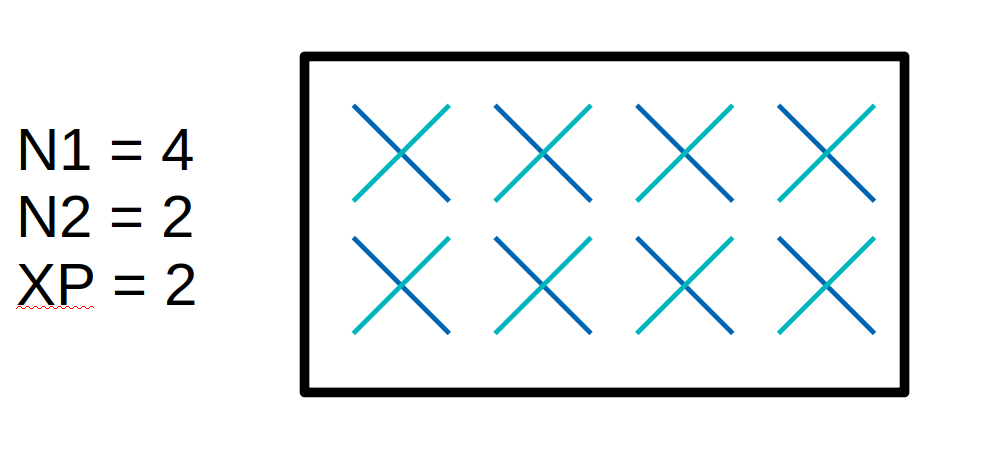

<!-- SPDX-License-Identifier: CC-BY-4.0 -->

# Running the OAI 5G gNB (nr-softmodem)

This document is a general overview of running `nr-softmodem`, the OAI 5G
gNodeB executable. For build instructions see [BUILD.md](BUILD.md). For UE
documentation see [runmodem-nrue.md](runmodem-nrue.md).


[[_TOC_]]

## Modes of operation

`nr-softmodem` supports several deployment modes. The default is "standalone"
mode.

| Option   | Mode       | Description |
|----------|------------|-------------|
| _none_   | standalone | Run gNB in SA mode (no flag). |
| `--nsa`  | NSA        | Non-standalone mode, requires an LTE eNB, see [NSA documentation](TESTING_OAI_NSA_COTS_UE.md). |
| phy-test | `--phy-test` | Test modes without random access, see [nrUE page](runmodem-nrue.md). |
| do-ra    | `--do-ra` | Test mode without a core network or RRC connection, see [nrUE page](runmodem-nrue.md). |
| noS1     | `--noS1` | Manually inject traffic, suitable for phy-test/do-ra without core network. |

## Basic invocation

From the build directory (with `build_oai`, by default `cmake_targets/ran_build/build/`):

```bash
sudo ./nr-softmodem -O <config_file> [options]
```

Example with a USRP B210:
```bash
sudo ./nr-softmodem -O ../../../targets/PROJECTS/GENERIC-NR-5GC/CONF/gnb.sa.band78.fr1.106PRB.usrpb210.conf -E --continuous-tx
```

CI-tested sample configuration files are in `ci-scripts/conf_files/`. Sample
configuration files for various hardware can be found under
`targets/PROJECTS/GENERIC-NR-5GC/CONF/`.

## Configuration file

The configuration file can use either libconfig (`.conf`) or YAML (`.yaml`)
syntax, based on the file ending. The main sections are:

- `gNBs`: cell identity, PLMN, physical cell parameters, AMF address
- `MACRLCs`: MAC/RLC layer settings
- `L1s`: L1 layer settings and thread pinning
- `RUs`: radio unit configuration (device selection, antennas, gains)
- `security`: ciphering and integrity algorithm preferences
- `log_config`: per-module log levels

Individual parameters can be overridden on the command line using the
`--Section.[index].param value` syntax, e.g.
`--gNBs.[0].min_rxtxtime 6`.

### Core network connectivity

In the `gNBs` section, set the following to connect to a 5G core (AMF):

```
gNBs = (
{
    tracking_area_code = 1;
    plmn_list = ({ mcc = 001; mnc = 01; mnc_length = 2; snssaiList = ({ sst = 1; sd = 0xffffff; }) });
    nr_cellid = 12345678L;

    amf_ip_address = ({ ipv4 = "192.168.70.132"; });

    NETWORK_INTERFACES :
    {
        GNB_IPV4_ADDRESS_FOR_NG_AMF = "192.168.70.129";  // N2 interface
        GNB_IPV4_ADDRESS_FOR_NGU    = "192.168.70.129";  // N3 interface
        GNB_PORT_FOR_S1U            = 2152;
    };
});
```

- `plmn_list` must match the PLMN configured in the AMF.
- `amf_ip_address` is the IP address of the AMF.
- `GNB_IPV4_ADDRESS_FOR_NG_AMF` is the local IP address of the gNB's N2 interface.
- `GNB_IPV4_ADDRESS_FOR_NGU` is the local IP address of the gNB's N3 interface.

### MAC configuration

In the `MACRLCs` section, configure MAC parameters. See the [MAC user
documentation](MAC/mac-usage.md) for more information.

### L1 configuration

The `L1s` section configures the L1 (physical layer) processing pipeline.

- `tr_n_preference`: transport to the MAC layer. Normally `local_mac` (shared
  memory). Set to `nfapi` for a networked L1/MAC split; see [nFAPI docs](nfapi.md).
- `prach_dtx_threshold`: energy threshold (in dB x10) for PRACH preamble detection. Lower
  values increase sensitivity but may cause false detections. Typical range:
  60–200.
- `pucch0_dtx_threshold`: energy threshold for PUCCH format 0 (SR/HARQ-ACK)
  detection. Similar trade-off as `prach_dtx_threshold`. Typical range: 10–100.
- `pusch_dtx_threshold`: energy threshold for PUSCH detection. Similar
  trade-off as `prach_dtx_threshold`. Typical range: 10–100.
- `ofdm_offset_divisor`: controls a small timing advance applied to the OFDM
  signal to ensure samples arrive before the processing deadline. Set to
  `UINT_MAX` (i.e., `4294967295`) for zero offset; a value of `8` gives an
  offset of `frame_length / 8`. The default value of `8` works well in most
  cases.
- `max_ldpc_iterations`: maximum number of LDPC decoder iterations. Fewer
  iterations reduce CPU load at the cost of UL error rate. Default is 8, but
  might be as high as 20 or more..
- `L1_rx_thread_core` / `L1_tx_thread_core`: pin the L1 RX and TX threads to
  specific isolated CPU cores. Recommended for real-time performance, especially
  with O-RAN 7.2 fronthaul.
- `phase_compensation` (FHI 7.2 only): set to `0` if phase compensation is done
  in the O-RU, `1` if it should be done in the DU (software). Must match the
  O-RU configuration.
- `tx_amp_backoff_dB` (FHI 7.2 only): output amplitude backoff in dB relative
  to full scale. Must be set according to the O-RU vendor documentation to avoid
  exceeding the RU's power limits.

### RU configuration

The `RUs` section describes the radio unit, i.e., either an integrated RF device
(split 8 radio) or a remote RU connected via a fronthaul interface (e.g., O-RU).

- `local_rf`: `"yes"` for a locally attached RF device (USRP, etc.), `"no"`
  for a remote RU (e.g., O-RAN 7.2 fronthaul).
- `nb_tx` / `nb_rx`: number of TX and RX antenna ports. Must be consistent with
  the antenna port configuration in `gNBs` (see [MIMO section](#5g-gnb-mimo-configuration)).
- `att_tx` / `att_rx`: software attenuation applied to TX/RX samples in dB.
  Used to reduce signal levels in software before they reach the RF device.
- `bands`: list of NR band numbers this RU operates on, e.g. `[78]`.
- `max_pdschReferenceSignalPower`: maximum PDSCH reference signal power in dBm.
  Used by the UE for path loss estimation. Should match the actual transmit
  power level.
- `max_rxgain`: maximum RX gain of the RF device in dB. This is the hardware
  gain limit; the actual gain used may be lower.
- `clock_src`: clock reference source. `"internal"` uses the device's own
  oscillator; `"external"` expects an external 10 MHz reference; `"gpsdo"`
  uses a GPS-disciplined oscillator. Applicable only for USRP.
- `sdr_addrs`: device address string passed to the RF driver. Used notably with
  USRP and BladeRF devices.
- `ru_thread_core`: CPU core for the RU fronthaul thread. Should
  be an isolated core (FHI 7.2 only).

### Frequency and cell configuration

Key parameters in `servingCellConfigCommon`:

- `absoluteFrequencySSB` / `dl_absoluteFrequencyPointA`: DL frequency in NR-ARFCN for SSB and PointA
- `dl_frequencyBand` / `ul_frequencyBand`: NR band number
- `dl_carrierBandwidth` / `ul_carrierBandwidth`: bandwidth in PRBs
- `dl_subcarrierSpacing`: subcarrier spacing (0=15 kHz, 1=30 kHz, 2=60 kHz, 3=120 kHz)
- `ssPBCH_BlockPower`: SSB transmit power in dBm (EPRE of SSB resource elements)
- `prach_ConfigurationIndex`, `prach_msg1_FrequencyStart`: PRACH configuration

For a reference of frequency parameters and band configurations see
[gNB frequency setup](gNB_frequency_setup.md).

### Security

The `security` section controls NAS/AS security algorithm selection:

```
security = {
  # preferred ciphering algorithms
  # the first one of the list that an UE supports in chosen
  # valid values: nea0, nea1, nea2, nea3
  ciphering_algorithms = ( "nea0" );

  # preferred integrity algorithms
  # the first one of the list that an UE supports in chosen
  # valid values: nia0, nia1, nia2, nia3
  integrity_algorithms = ( "nia2", "nia0" );

  # setting 'drb_ciphering' to "no" disables ciphering for DRBs, no matter
  # what 'ciphering_algorithms' configures; same thing for 'drb_integrity'
  drb_ciphering = "yes";
  drb_integrity = "no";
};
```

## Common radio devices

### RFsimulator

The RFsimulator replaces the radio device with a virtual radio, allowing
gNB and UE to run without hardware. Built by default. Ideal for testing,
debugging, and development. Add `--rfsim` to the command line.

See the [RFsimulator documentation](../radio/rfsimulator/README.md).

### USRP (B2xx, N3xx, X3xx, x4xx)

Build with `build_oai -w USRP`/`cmake -DOAI_USRP=ON`. The device is selected
automatically. Common per-device recommendations:

- B210: use `-E --continuous-tx`; limited to ~40 MHz bandwidth
- N3xx/X3xx: use `--usrp-tx-thread-config 1`; consider `--tune-offset` or
  `ul_prbblacklist` for DC noise at high bandwidth

For network tuning of 10G USRP devices (N300, X300):
```bash
sudo ethtool -G <ifname> tx 4096 rx 4096
sudo sysctl -w net.core.wmem_max=62500000
sudo sysctl -w net.core.rmem_max=62500000
```

See also the [COTS UE tutorial](NR_SA_Tutorial_COTS_UE.md) and
[performance tuning guide](tuning_and_security.md).

### O-RAN 7.2 Fronthaul (FHI)

For O-RAN split 7.2 with an O-RU, build with `build_oai -t
oran_fhlib_5g`/`cmake -DOAI_FHI72=ON`. Configuration requires a `fhi_72`
section and DPDK setup. See the [O-RAN FHI 7.2 tutorial](ORAN_FHI7.2_Tutorial.md).

## Higher-layer splits

### CU/DU (F1) and CU-CP/CU-UP (E1) splits

F1 splits the gNB into a CU (RRC/PDCP/SDAP) and one or more DUs (RLC/MAC/L1).
See [F1AP docs](F1AP/F1-design.md). The CU and DU connect via F1AP over SCTP.
The DU configuration specifies the CU IP address. 

To run a split gNB, start a CU and one or more DUs separately:

```bash
# CU
sudo ./nr-softmodem -O ../../../targets/PROJECTS/GENERIC-NR-5GC/CONF/cu_gnb.conf

# DU
sudo ./nr-softmodem -O ../../../targets/PROJECTS/GENERIC-NR-5GC/CONF/du_gnb.conf
```

E1 splits the CU into a CU-CP (RRC) and one or more CU-UPs (PDCP/SDAP) (and
therefore also requires F1). See [E1AP docs](E1AP/E1-design.md).

### FAPI/nFAPI splits

FAPI splits the L1 and MAC. It is used internally by the monolithic gNB. It is
possible to separate L1 and L2 into separate processes and use shared memory
between both. It is further possible use networked FAPI (nFAPI) to separate L1
and L2 into separate processes on different hosts and use socket-based
communication. See the [FAPI/nFAPI documentation](nfapi.md)

## 5G gNB MIMO configuration

In order to enable DL-MIMO in OAI 5G softmodem, the prerequisite is to have `do_CSIRS = 1` in the configuration file. This allows the gNB to schedule CSI reference signal and to acquire from the UE CSI measurements to be able to schedule DLSCH with MIMO.

The following step is to set the number of PDSCH logical antenna ports. These needs to be larger or equal to the maximum number of MIMO layers requested (for 2-layer MIMO it is necessary to have at least two logical antenna ports).



This image shows an example of gNB 5G MIMO logical antenna port configuration. It has to be noted that logical antenna ports might not directly correspond to physical antenna ports and each logical antenna port might consist of a sub-array of antennas.

In 5G the basic element is a dual-polarized antenna, therefore the minimal DL MIMO setup with two logical antenna ports would consist of two cross-polarized antenna elements. In a single panel configuration, as the one in the picture, this element can be repeated vertically and/or horizontally to form an equi-spaced 1D or 2D array. The values N1 and N2 represent the number of antenna ports in the two dimensions and the supported configurations are specified in Section 5.2.2.2.1 of TS 38.214.

The DL logical antenna port configuration can be selected through configuration file. `pdsch_AntennaPorts_N1` can be used to set N1 parameter, `pdsch_AntennaPorts_N2` to set N2 and `pdsch_AntennaPorts_XP` to set the cross-polarization configuration (1 for single pol, 2 for cross-pol). To be noted that if XP is 1 but N1 and/or N2 are larger than 1, this would result in a non-standard configuration and the PMI selected would be the identity matrix regardless of CSI report. The default value for each of these parameters is 1. The total number of PDSCH logical antenna ports is the multiplication of those 3 parameters.

Finally the number of TX physical antenna in the RU part of the configuration file, `nb_tx`, should be equal or larger than the total number of PDSCH logical antenna ports.

It is possible to limit the number supported DL MIMO layers via RRC configuration, e.g. to a value lower than the number of logical antenna ports configured, by using the configuration file parameter `maxMIMO_layers`.

[Example of configuration file with parameters for 2-layer MIMO](https://gitlab.eurecom.fr/oai/openairinterface5g/-/blob/develop/targets/PROJECTS/GENERIC-NR-5GC/CONF/gnb.sa.band77.fr1.273PRB.2x2.usrpn300.conf)

## IF (Intermediate Frequency) equipment

OAI supports RF front-ends operating on arbitrary frequencies outside standard
3GPP NR bands. Configure in the `RUs` section of the gNB config file:

- `if_freq`: DL frequency in Hz (suffix with `L` in libconfig, e.g. `2169080000L`)
- `if_offset`: UL frequency offset in Hz

## Related documentation

Further documentation not referenced above:

- [Build instructions](BUILD.md)
- [NR SA tutorial with OAI nrUE](NR_SA_Tutorial_OAI_nrUE.md)
- [NTN configuration](ntn-configuration.md)
