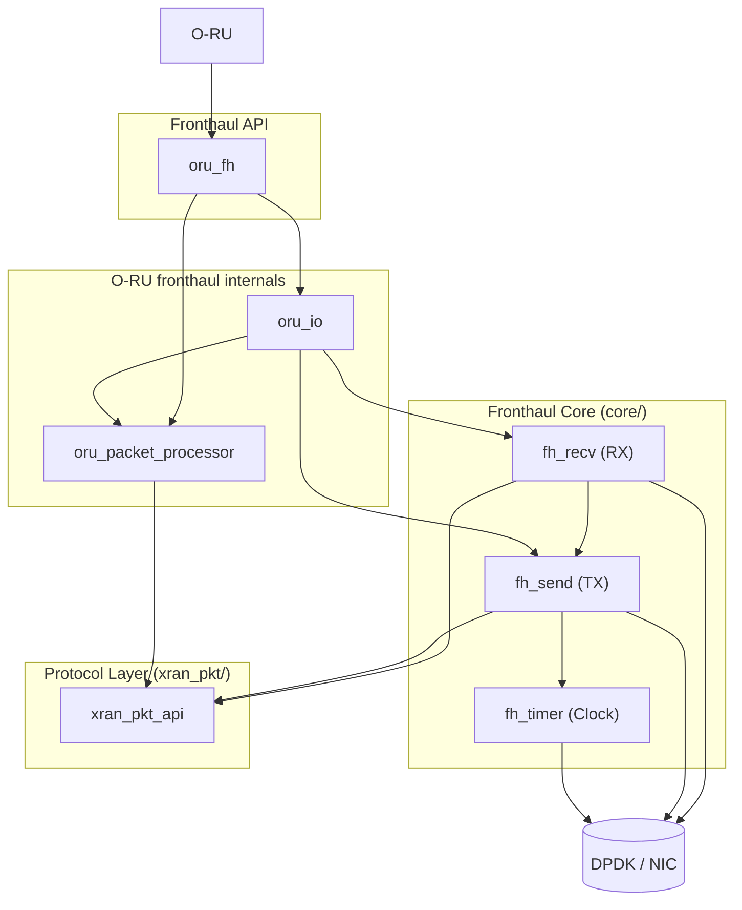
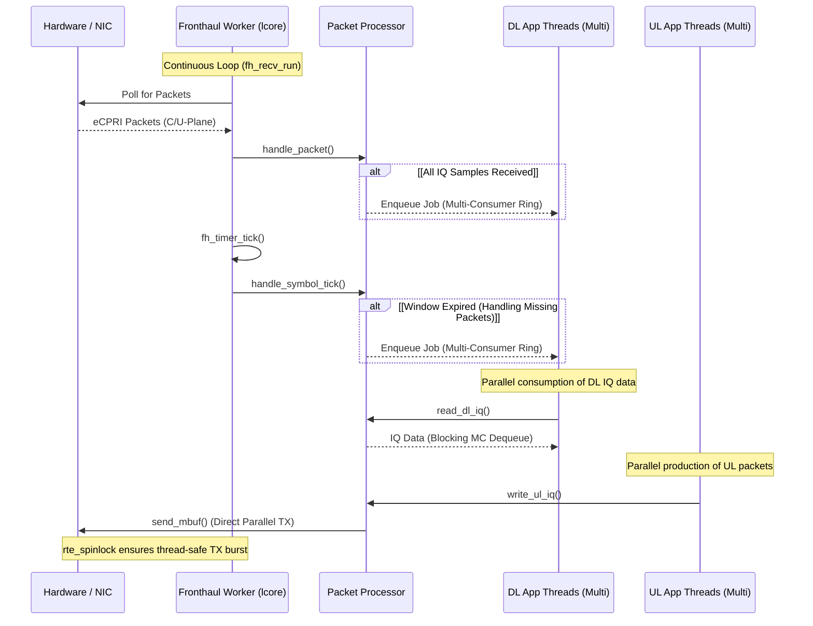

# Fronthaul Library

Fronthaul stack for 7.2x split using DPDK. Currently supports O-RU only; O-DU support is not implemented.

## Architecture overview

### Software component diagram

### Threading

The library uses a simplified threading model designed for low-latency synchronization:

- **Single Worker Thread**: A single worker thread (pinned to `rx_core`) handles both packet reception and timing.
The `fh_timer` is driven by a `tick()` function called within the RX poll loop. This ensures that timing events are
processed with minimal context-switching overhead.
- **Immediate Transmission**: Packet transmission happens immediately when the application calls the send function.

#### Sequence Diagram

## Core API (`oru_fh.h`)

- `oru_fh_init`: Initializes DPDK EAL, configures ports, and sets up memory pools based on PRB requirements.
- `oru_fh_start`: Launches the worker thread and starts the fronthaul processing loop.
- `oru_fh_stop`: Gracefully stops the worker thread and releases resources.
- `oru_fh_tx_read_symbol`: Intended for reading UPlane data for a specific slot/symbol in a synchronized manner.
- `oru_fh_rx_send_pusch`/`prach`: Sends IQ via UPlane to DU

## Configuration

See `oru_fh_config_t` for details

## Tools

### Packet Dissector - `xran_pcap_dump`
A tool used to verify that packets are correctly formed. It reads PCAP files and dissects them using the `xran_pkt`
library to ensure compatibility with O-RU/O-DU implementations.
