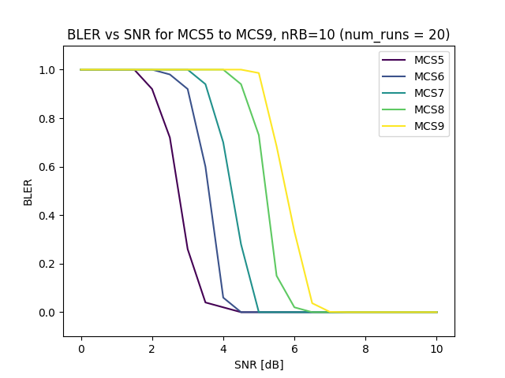
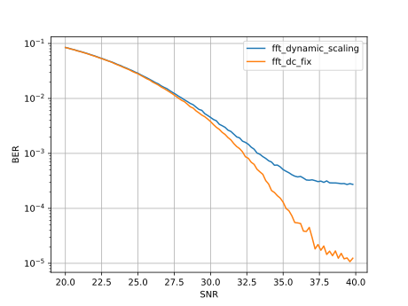

<!-- SPDX-License-Identifier: CC-BY-4.0 -->

# Plotting tools

## `ul_bler_vs_snr_graph.py`

This generates UL BLER vs SNR plots using nr_ulsim. It uses cache so subsequent runs are faster.
Assumes your nr_ulsim is in `../../cmake_targets/ran_build/build`. Run with -h flag to see options

Example graph:

### Cache usage and modifting `nr_ulsim` command

Modify the script call to `nr_ulsim` if you want a different channel model or other flags in the `nr_ulsim` command.
Remember to clear the cache (remove `cache.pkl` from this folder) so that the results from a different run are not 
taken from the cache.
 
Same goes for any software modifications of `nr_ulsim` - the cache is not aware of the software version used to generate
the data - remember to clear your cache manually if you are comparing different `nr_ulsim` versions.

The script also allows to skip usage of the cache with `--rerun` option.

## `dl_graph.py`

This generates plots from data saved from nr_dlsim. It takes data in two formats:

1. Plots frequency domain channel estimates, constellation diagram and LLRs from data read in binary format. The data is generated from `nr_dlsim -w`
2. Plots BER (other also possible) from CSV data generated by `nr_dlsim -Z`.

The plots are saved in three formats: `.png`, `.pdf` and `.svg`.

### Example graphs:
#### BER

## `plot_power_control.sh`

This plots the relevant graphs for power control at the gNB, exported through T
and recorded via the [`csv` tracer](../../common/utils/T/DOC/T/csv.md) and
plotted with `gnuplot`.

Run first the `csv` tracer in one terminal, selecting the desired quantities, and
write them out to a file:

    ./common/utils/T/tracer/csv -d ../common/utils/T/T_messages.txt -s $'\t' -t time GNB_MAC_PUSCH_POWER_CONTROL time snrx10 phr tpc tb_size txpower_calc rbSize mcs > /tmp/pusch.csv

in a second terminal, run the gNB with desired configuration, and pass the
`--T_stdout 2` option to connect to the `csv` tracer:

    sudo ./nr-softmodem -O <config> --T_stdout 2

Note that you could also run both in one window, connecting both commands with
a `&`.  In that case, it's important to run the `nr-softmodem` at second
position, which will receive signals and stop the `csv` tracer when stopping
the main process.

The script might also be used to print PUCCH SNR. This can be achieved by only
recording the relevant fields with the `csv` tracer for trace
`GNB_MAC_PUCCH_POWER_CONTROL

    ./common/utils/T/tracer/record -d ../common/utils/T/T_messages.txt -OFF -on GNB_MAC_PUSCH_POWER_CONTROL -on GNB_MAC_PUCCH_POWER_CONTROL -o /tmp/record.raw

Use the `replay` tracer and `csv` to separate into PUSCH and PUCCH traces.

After recovering the `pusch.csv` file, you could plot it with a script.

    ./plot-power-control.gp.sh /tmp/pusch.csv

The script prints four graphs:

1. prints instantaneous SNR, and "deltaMCS" (the power used for the
   transmission if in deltaMCS mode that accounts for MCS). It also prints an
   average SNR, but this has to be manually post-processed from the instanteous
   SNR values (`snrx10` above)
2. TPC commands and PHR of the UE
3. Resource blocks used for all transmissions, and the MCS
4. transport block size of the transmission, to estimate the amount of traffic.

The script should either auto-scale graphs or have sensible defaults. It prints
on screen. There is code to print to a file; uncomment the relevant lines to
achieve this.
